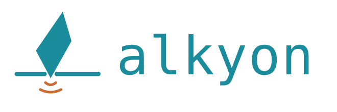

<h1 align="center">
  <br>
</h1>

<p align="center">
  A portable data workbench: real dialect SQL, DuckDB federation,<br>
  and a terminal your LLM agent can drive.
</p>

<p align="center">
  <a href="GUIDE.md"><strong>User guide →</strong></a>
</p>

ἀλκυών — the Greek word for the kingfisher, the bird that dives through opaque water and
comes back with the catch. English borrowed it as *halcyon*, along with an H that ancient
scribes added by mistake. Pronounced *AL-kee-on*.

---

## What it is

Alkyon is a single Rust binary. It exposes an HTTP + WebSocket API and serves a static web
UI that consumes it. That is the entire architecture — there is no second codebase for the
desktop build.

It connects to **SQL Server** (on-prem, Azure SQL, Microsoft Fabric), **PostgreSQL**,
**MySQL/MariaDB**, and **a folder or a single file** on disk — and gives you a schema
explorer, a multi-dialect SQL editor with cross-schema search, a streaming result grid, an
integrated terminal, and DuckDB for joining across all of it.

Every driver is compiled in. No ODBC, no OLE DB, no `libpq`, nothing to install — which is
what makes the single binary a real promise rather than a slogan.

## Why

Heavyweight database IDEs are built for teams and for every engine on earth. Alkyon is built
for one engineer with two or three sources, who needs to write vendor-specific SQL, join a
spreadsheet against a production table, and hand the tedious parts to an agent — without a
JVM, a licence server, or a workspace concept.

## Two ways to query

**Native.** Pure dialect per source: T-SQL to SQL Server, PL/pgSQL to Postgres, MySQL to
MySQL. No translation layer and no lowest common denominator, so DDL, views, stored
procedures and vendor-specific syntax all behave exactly as the server expects. Nothing sits
between your text and the engine.

A **folder source** is the same idea pointed at a disk: every `.csv`, `.parquet` or `.json`
under a path becomes a table, subdirectories become schemas, and you write DuckDB SQL against
them. It gets the explorer, the autocompletion and the search like any other source — and it
can read nothing outside the path you gave it.

**Federated.** A buffer that starts with `-- @duckdb` runs in DuckDB, over tables you pull in
with `-- @import` and files in the open folder — join two servers against a spreadsheet, or
export a table straight to Parquet. Each import is still written in *its own* source's
dialect; only the query on top is DuckDB's. A buffer without the directive never touches
DuckDB.

## Also

- Credentials live in the OS keychain (Windows Credential Manager, Keychain, libsecret),
  never in a config file
- Results arrive a page at a time over WebSocket, the query staying open between pages so
  the next one is read on rather than re-fetched with an `OFFSET`
- Sources come from your own registry and, optionally, a committable one in the project
- Night Owl and Light Owl themes, following the OS unless you say otherwise

## Running it

```sh
cargo run          # http://127.0.0.1:8787
```

The first build compiles DuckDB from source and takes a few minutes — optimised even
in a debug build, deliberately: at `-O0` an aggregate over 39.7 M parquet rows took
78 seconds instead of 270 ms, which reads as a broken tool rather than a debug one. See the
[user guide](GUIDE.md) for everything else — adding a source, the keyboard, federation,
settings and the HTTP API.

### Changing the result grid

The grid is [glide-data-grid](https://github.com/glideapps/glide-data-grid), which is React,
which needs a bundler. That does **not** make npm part of building alkyon: the bundle is
committed under `src/ui/vendor/`, exactly like CodeMirror and xterm, and React never escapes
it — the rest of the UI stays plain ES modules talking to four methods on a handle.

```sh
cd tools/grid && npm install && npm run build   # rewrites src/ui/vendor/glide-data-grid.*
```

You only need this to change the grid. `cargo build` remains the whole build.

### Development databases

```sh
docker compose -f docker/compose.dev.yml up -d      # postgres :55432, mysql :53306, sql server :51433
ALKYON_SOURCES=docker/sources.dev.json cargo run
ALKYON_SOURCES=docker/sources.dev.json cargo test   # live tests skip themselves without it
node --test tests/ui/*.test.mjs                     # the JS unit tests
docker compose -f docker/compose.dev.yml down -v
```

All three servers get the same `sales` demo schema — two tables, a composite primary key, a
view, and 1500 rows so a streamed `SELECT` spans several batches. The federated tests join
two engines and assert the results agree exactly, which is what proves the type handling.

`tests/files.rs` needs no server at all: folder sources are read by the DuckDB inside the
binary, so those run everywhere.

## State of things

Working and covered by tests against live servers: all three database connectors, streaming
and cancellation, the keychain, the schema explorer and cross-schema search, tabs and file
save, the open folder, the PTY terminal, and DuckDB federation over Postgres, SQL Server,
MySQL, CSV and Parquet. Folder and file sources are covered by tests that need no server.

Written but not yet exercised: Excel import (calamine), Windows integrated authentication,
and Entra ID token auth — the last two need servers this has not been run against.

Not built yet:

- **Skills and agents** — the Git-versioned folder of Markdown skills meant to be injected
  into the terminal's context. The terminal is there; the skills are not.
- **Packaging** — no Tauri installer and no Docker image yet, though the architecture is
  built for both. Today it is `cargo run`.
- **`ATTACH`-based federation**, for when predicate pushdown matters more than keeping the
  import in its native dialect.
- **Blob-storage sources.** Local folders and files are in; anything over the network needs
  DuckDB's `httpfs`, which would have to be fetched at runtime.
- **Excel as a source.** A folder source skips `.xlsx`; spreadsheets go through `-- @excel`
  in a federated buffer.

Deliberately out of scope: in-grid editing, migration management, multi-user auth. Oracle is
absent but the `Connector` trait is ready for it.

One thing to know: DuckDB is compiled in unconditionally, which puts the binary in the tens
of megabytes rather than the ten the design originally aimed at.

## Licence

[PolyForm Noncommercial 1.0.0](LICENSE). Use it, change it, share it, for any noncommercial
purpose — personal projects, study, research, and any charity, school, public research body
or government institution, whatever funds them. Selling it, or using it in the course of a
business, needs a separate licence: ask.

This is deliberately **not** an open-source licence, and calling it one would be wrong. It
restricts a field of use, which the OSI definition does not allow.

The vendored libraries keep their own terms and are unaffected: CodeMirror, xterm.js and the
glide-data-grid bundle are all MIT, with their texts in `src/ui/vendor/`. So are DuckDB and
the Rust crates, under MIT or Apache-2.0. None of them forbid the combined work being
licensed as above, as long as their notices travel with it — which is why those files are
committed rather than fetched.
